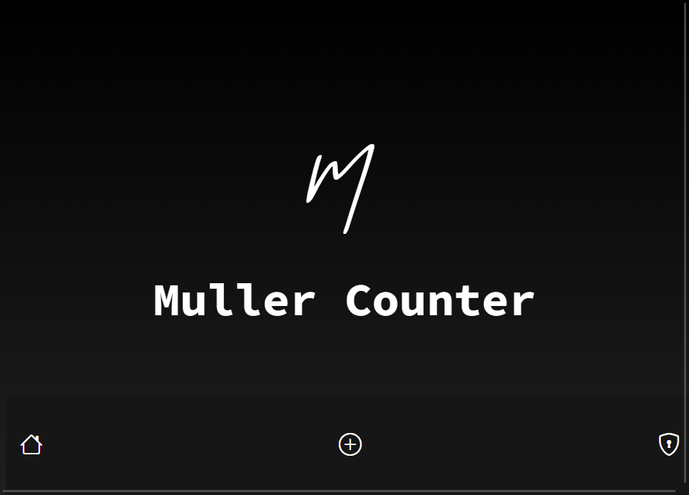

  <h1>Counter App with Realtime Firebase Integration</h1>
  

## Description

Welcome to our elegant Counter App! This web application was crafted with love using HTML, CSS, JavaScript, and the delightful GSAP for stunning animations. It's also backed by Firebase for real-time data magic and is even available as a Progressive Web App (PWA) for a seamless, app-like experience.

## Features

- Real-time Updates: Watch as changes ripple through all your devices in real-time.
- Dazzling Animations: We've sprinkled some GSAP magic to make your counting experience delightful.
- PWA Ready: Install it on your device and enjoy it like a native app.
- User-Friendly Interface: Simple and intuitive controls make counting a breeze.

## Technologies Used

- **HTML**: The building blocks of our web pages.
- **CSS**: For a visually pleasing and responsive design.
- **JavaScript**: The brains behind our interactive app.
- **GSAP (GreenSock Animation Platform)**: Smooth animations that make you smile.
- **Firebase**: Real-time data storage and synchronization for the modern web.
- **PWA**: Elevating your mobile and desktop experience.

## Installation

1. **Clone this repository** to your local machine.

2. Open your terminal and navigate to the project folder.

3. Launch the app by opening `index.html` in your preferred web browser.

4. Make it a PWA:
   - On your desktop browser, keep an eye out for the install button in the address bar.
   - On mobile devices, add it to your home screen from the browser menu.

## Resetting the Counter

To reset the counter, follow these steps:

1. Click the "Settings" button to access the settings page.

2. Enter the password "Demo-password" to unlock the reset function.

3. Click the "Reset Counter" button, and the counter will gracefully return to zero.

## Demo

Witness the beauty of our Counter App in action by checking out the live demo [here](https://mullercounter.netlify.app/).

## Credits

- Developed by Michon and Lars
- Animation inspiration and guidance from [GSAP Documentation](https://greensock.com/docs/v3/Introduction)

## Contact

If you have any questions, suggestions, or just want to say hello, don't hesitate to reach out to us at [Michon.vv@gmail.com].

We hope you enjoy using this Counter App! Your support and contributions are greatly appreciated.

Happy Counting! 🚀🔢
